### 设计说明
使用 flag 包对命令行参数进行解析，使用os，bufio对文件、os.Stdin进行读取，写出则调用os.Stdout.Write()，标准错误输出使用 fmt.Fprintf(os.Stderr, "error message")。
1. 前头的命令行参数解析较为容易，只是根据要求检查参数是否符合要求。
2. 对于涉及Stdin和文件读取部分，直接上代码说明
```
	line := bufio.NewScanner(file_in)  // file_in 替换为 os.Stdin 即为 Stdin读取
    for line.Scan() {  // 一次扫描一行
			flag := false
			for _,c := range line.Text() {
				if c == '\f' {
					if cur_page >= sa.s && cur_page <= sa.e {
						flag = true
						os.Stdout.Write([]byte("\n"))
						stdin.Write([]byte("\n"))  // 此处的stdin是写入管道的输入，用于打印机
					}
					cur_page++;
				} else {
					if cur_page >= sa.s && cur_page <= sa.e {
						os.Stdout.Write([]byte(string(c)))
						stdin.Write([]byte(string(c)))
					}
				}
			}
			if flag != true && cur_page >= sa.s && cur_page <= sa.e {
				os.Stdout.Write([]byte("\n"))
				stdin.Write([]byte("\n"))
			}
			flag = false
    }
```
3. 对于管道问题，使用了 `os/exec`包来生成子进程并通过管道输入信息，这里给出部分代码
```
	cmd := exec.Command("cat", "-n")
	stdin, err:= cmd.StdinPipe()
	if err != nil {
		panic(err)
	}
	···
	stdin.Close()
	cmd.Stdout = os.Stdout
	cmd.Start()
```
4. 其余部分请参考代码，较为简单。如有任何疑惑，可对照[selpg原作者博客](https://www.ibm.com/developerworks/cn/linux/shell/clutil/index.html)，其注释更为精确明晰

### 测试部分
#### Before:
生成了两个测试文件。testfile_f，每一行结尾都为 ‘\f'，共100行。testfile则为'\n'结尾也为100行
#### Tests:
1.
input:	`./selpg -s 1 -e 1 testfile`
output:
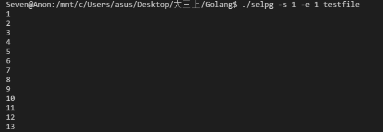
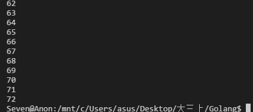
未显示的部分均为数字，到达72之后则停止

2.
input: `./selpg -s 1 -e 1 < testfile`
output:
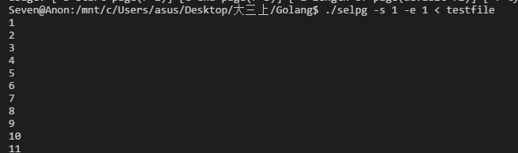
类似于1的输出

3.
input: `python testout.py | ./selpg -s 1 -e 1 < testfile`
output:
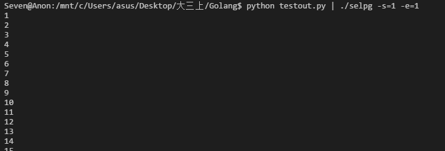
结果类似于1，在72停止

4.
input: `./selpg -s 1 -e 1 testfile > testout`
output:
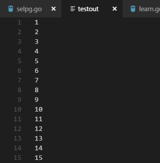
写入成功，同样是在72处结尾

5.
input: `selpg -s2 -e1 testfile 2>errorfile`
output: 

屏幕没有打印输出
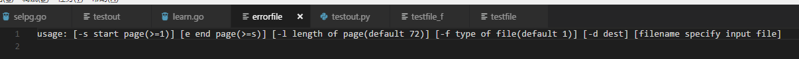
文件打印了输出

6.
input: `selpg -s1 -e10 testfile >testout 2>errorfile`
output:
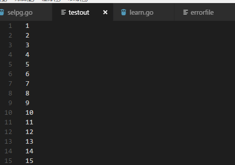
testout保存了出错前的输出
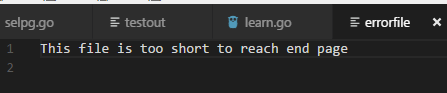
errorfile输出了错误信息

命令行没有消息打印
7.
input: `./selpg -s 1 -e 10 testfile 2>/dev/null > testout` 

testout文件跟6一样。没有错误消息打印
8.
input:
`./selpg -s 1 -e 10 input_file >/dev/null`
output:

9.
input:
`./selpg -s 1 -e 1 testfile | go run learn.go`
learn.go代码为：
```
package main
import (
	"fmt"
	"os"
	"bufio"
)
func main() {
	tmp_s := bufio.NewScanner(os.Stdin)
	for tmp_s.Scan() {
		fmt.Printf(tmp_s.Text()+"\n")
	}
}
```
output:
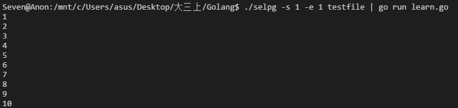
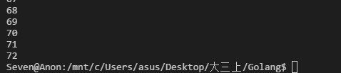

10.
input:
`./selpg -s 1 -e 1 testfile 2>errorfile | go run learn.go`
output:
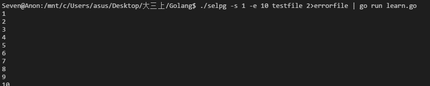
命令行无错误出现
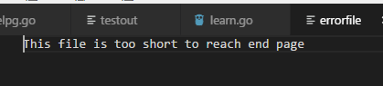
errorfile写入错误

11.
input:
`./selpg -s 1 -e 1 -l 10 testfile`
output:
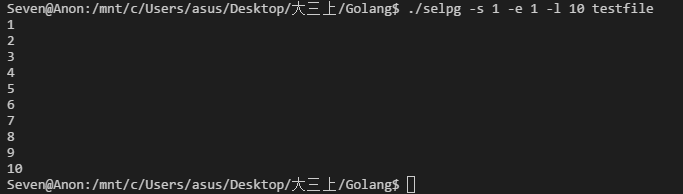
12.
input:
`selpg -s 1 -e 10 -d lp1 testfile`
由于没有打印机实验，无法测试，将之替换为`cat -n`进行测试
output:
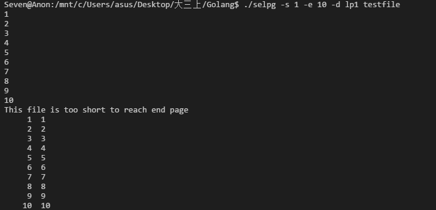
显然结果是理想的

13.
input : `selpg -s 1 -e 1 testfile > testout 2>errorfile &`
output:
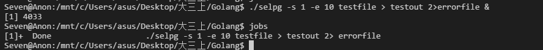
挂起成功并且执行完毕

14.
input: `selpg -s 1 -e 10 -f testfile`
output:
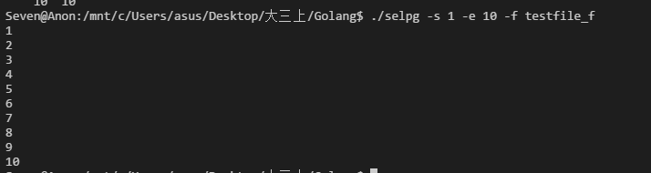

